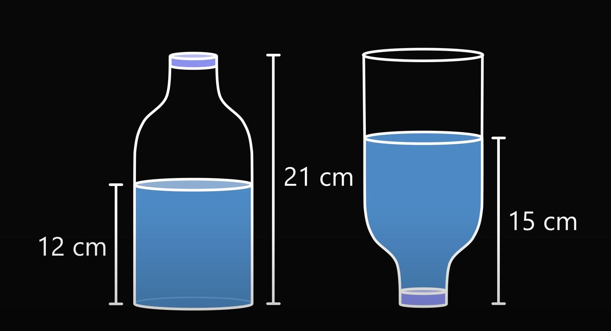
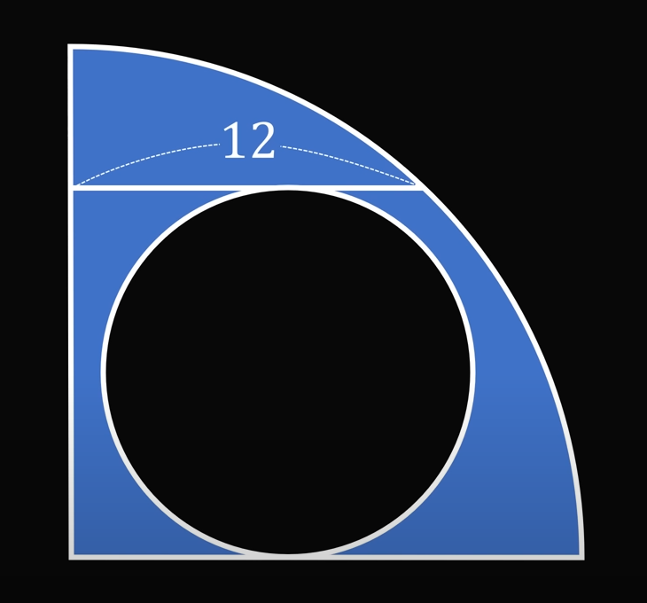

1. What is the length of the top? {width="1.9689in"
height="1.052in"}

    1. $\sqrt{71}$
    2. $8$
    3. $\sqrt{80}$

2. How tall is the table? {width="2.8575in"
height="1.2346in"}

    1. 150
    2. 140
    3. 170

3. Solve for x, where,
$x = \sqrt{1 + 2 \sqrt{ 1 + 3 \sqrt{1 + 4 \sqrt{ 1 + \cdots}}}}$

    1. 3
    2. $\sqrt{3}$
    3. 1.717

4. {width="2.7882in"
height="1.5138in"}
What fraction of the bottle is full?

    1. $\frac{2}{3}$
    2. $\frac{1}{3}$
    3. $\frac{1}{2}$

5. How many radians make up 180 degrees?

    1. $\pi$
    2. $2$
    3. $2\pi$

6. {width="2.1193in"
height="1.9807in"}
Find the area shaded in blue

    1. $36\pi$
    2. $12\pi$
    3. $18\pi$

7. Depress the cubic equation:
$
x^3+3x^2-12x+8=0
$

    1. $y^3-15y+22=0$
    2. $y^3-22y+15=0$
    3. $x^3+3x^2-12x=-8$

8. Solve for both values of x,
$
x^2-2x+3
$

    1. $x=1-i\sqrt{3}i, 1+i\sqrt{3}$
    2. $x=1\pm\sqrt{3}$
    3. There are no real or imaginary solutions

9. What is the name of the line perpendicular to the tangent?

    1. The normal
    2. The ideal
    3. The usual

10. If $2x - 4y = 3$, what is the value of
$\frac{16^x}{256^y}$

    1. $64$
    2. $2048$
    3. It's not possible to answer

11. The vacuole is specific to which kind of cell? (that isn\'t a
micro-organism)

    1. A plant cell
    2. A human cell
    3. An animal cell (but not human)

12. Which countries do the cities of Perth, Adelaide, and Brisbane belong
to?

    1. Australia
    2. Tahiti
    3. South Africa

13. Which monarch officially made Valentine's day a holiday in 1537?

    1. Henry VIII
    2. Henry VI
    3. Queen Mary

14. Who was the first woman to receive a nobel prize in 1903?

    1. Marie Curie
    2. Jocelyn Bell
    3. Selma Lagerl\"{o}f

15. Who wrote the first dictionary?

    1. Robert Cawdrey
    2. Samuel Johnson
    3. Noah Webster

16. What is the smallest country in the world?

    1. Vatican City
    2. Liechtenstein
    3. Micronesia

17. Havana is the capital of which country?

    1. Cuba
    2. Venezuela
    3. Slovenia

18. What country has the most natural lakes?

    1. Canada
    2. USA
    3. Russia

19. What is the hottest planet in the solar system?

    1. Venus
    2. Earth
    3. Mercury

20. What colour is blood when it is not carrying oxygen?

    1. Dark red
    2. Blue
    3. Pink

21. What is the largest bone in the human body?

    1. The femur
    2. The tibia
    3. The Hyoid bone

22. What year was the United Nations established?

    1. 1945
    2. 1947
    3. 1957

23. Who was the last Tsar of Russia?

    1. Nicholas II
    2. Catherine the great
    3. Ivan the terrible

24. Which planet has the most moons in our solar system?

    1. Saturn
    2. Earth
    3. Jupiter

25. On which continent would you find the world's largest desert?

    1. Antarctica
    2. Africa
    3. Asia

26. How many colours are used on the South African flag?

    1. 6
    2. 1
    3. 3

27. What number is given to a diamond on the Mohs scale?

    1. 10
    2. 22
    3. 3000

28. Which country has the longest coastline?

    1. Canada
    2. United Kingdom of Great Britain and British Isles
    3. Africa

29. What does someone who follows antidisestablishmentarianism oppose?

    1. The Church of England
    2. Richard Norfolk
    3. Religion
