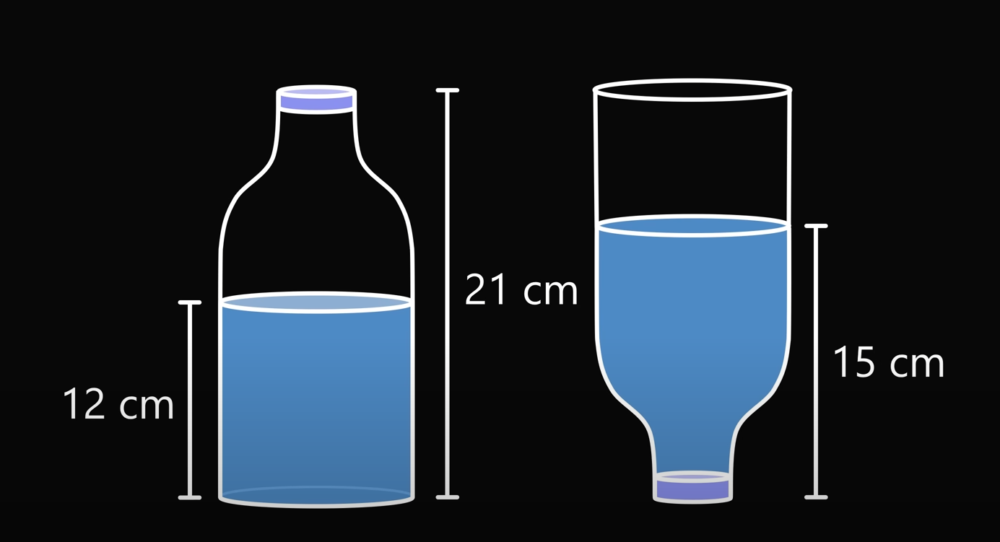
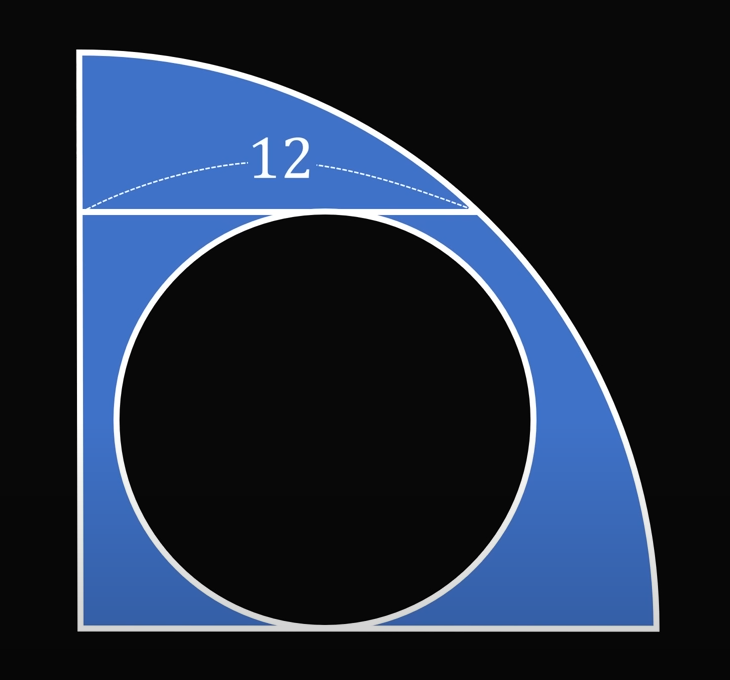

1. Which countries do the cities of Perth, Adelaide, and Brisbane belong to?

    1. Australia

    2. Tahiti

    3. South Africa

2. Who was the first woman to receive a nobel prize in 1903?

    1. Marie Curie

    2. Jocelyn Bell

    3. Selma Lagerlöf

3. What is the smallest country in the world?

    1. Vatican City

    2. Liechtenstein

    3. Micronesia

4. What country has the most natural lakes?

    1. Canada

    2. USA

    3. Russia

5. What colour is blood when it is not carrying oxygen?

    1. Dark red

    2. Blue

    3. Pink

6. What year was the United Nations established?

    1. 1945

    2. 1947

    3. 1957

7. Which planet has the most moons in our solar system?

    1. Saturn

    2. Earth

    3. Jupiter

8. How tall is the table? {width="2.8575in" height="1.2346in"}

    1. 150

    2. 140

    3. 170

9. If $2x - 4y = 3$, what is the value of $\frac{16^x}{256^y}$

    1. $64$

    2. $2048$

    3. It's not possible to answer

10. Solve for both values of x, $x^2-2x+3$

    1. $x=1-i\sqrt{3}, 1+i\sqrt{3}$

    2. $x=1\pm\sqrt{3}$

    3. There are no real or imaginary solutions

11. {width="2.7882in" height="1.5138in"} What fraction of the bottle is full?

    1. $\frac{2}{3}$

    2. $\frac{1}{3}$

    3. $\frac{1}{2}$

12. {width="2.1193in" height="1.9807in"} Find the area shaded in blue

    1. $36\pi$

    2. $12\pi$

    3. $18\pi$
