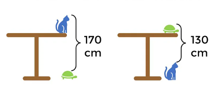
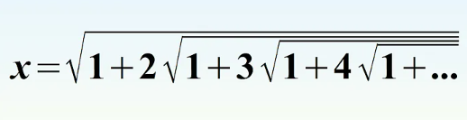

1. {width="1.9689in"
height="1.052in"} What is the length of the top?

    1. $\sqrt{71}$
	2. 8
	3. 9

2. {width="2.8575in"
height="1.2346in"}
How tall is the table?

	1. 150
	2. 170
	3. 130

3. {width="3.3075in"
height="0.8492in"}
Solve for x

    1. $x=3$
	2. $x=2$
	3. $x=\sqrt{2}$
	
4. {width="2.7882in"
height="1.5138in"}
What fraction of the bottle is full?

    1. $\frac{2}{3}$
	2. $\frac{4}{9}$
	3. $\frac{4}{7}$
	
5. How many radians make up 180 degrees?

	1. $\pi$
	2. $1$
	3. 2
	
6. {width="2.1193in"
height="1.9807in"}
Find the area shaded in blue

	1. $36\pi$
	2. $33\pi$
	3. $39\pi$
	
7. Solve $x^2^-2x+3$ for both values of x
   1. $x=1-\sqrt{3}i, 1+\sqrt{3}i$
   2. $x=1, -1$
   3. $x=2\pm\sqrt{2}i$
   
8. What is the name of the line perpendicular to the tangent?

	1. the normal
	2. the tangent
	3. the chord
	
9. If $2x - 4y = 3$, what is the value of $\frac{16^x}{256^y}$

	1. 64
	2. 82
	3. 1024

10. The vacuole is specific to which kind of cell? (that isn\'t a
micro-organism)

	1. A plant cell
	2. A jail cell
	1. A blood cell

11. Which countries do the cities of Perth, Adelaide, and Brisbane belong
to?

	Australia

Which monarch officially made Valentine's day a holiday in 1537?

A: Henry VIII

Who was the first woman to receive a nobel prize in 1903?

A: Marie Curie

\
Who wrote the first dictionary?

A: Robert Cawdrey

What is the smallest country in the world?\
A: Vatican City

Havana is the capital of which country?

A: Cuba

What country has the most natural lakes?

A: Canada

What is the hottest planet in the solar system?

A: Venus

What colour is blood when it is not carrying oxygen?

A: Dark red

What is the largest bone in the human body?\
A: The femur

What year was the United Nations established?

A: 1945

Who was the last Tsar of Russia?

A: Nicholas II

Which planet has the most moons in our solar system?

A: Saturn

On which continent would you find the world's largest desert?

A: Antarctica

How many colours are used on the South African flag?

A: 6

What number is given to a diamond on the Mohs scale?

A: 10

Which country has the longest coastline?

A: Canada

What does someone who follows antidisestablishmentarianism oppose?

A: The Church of England
